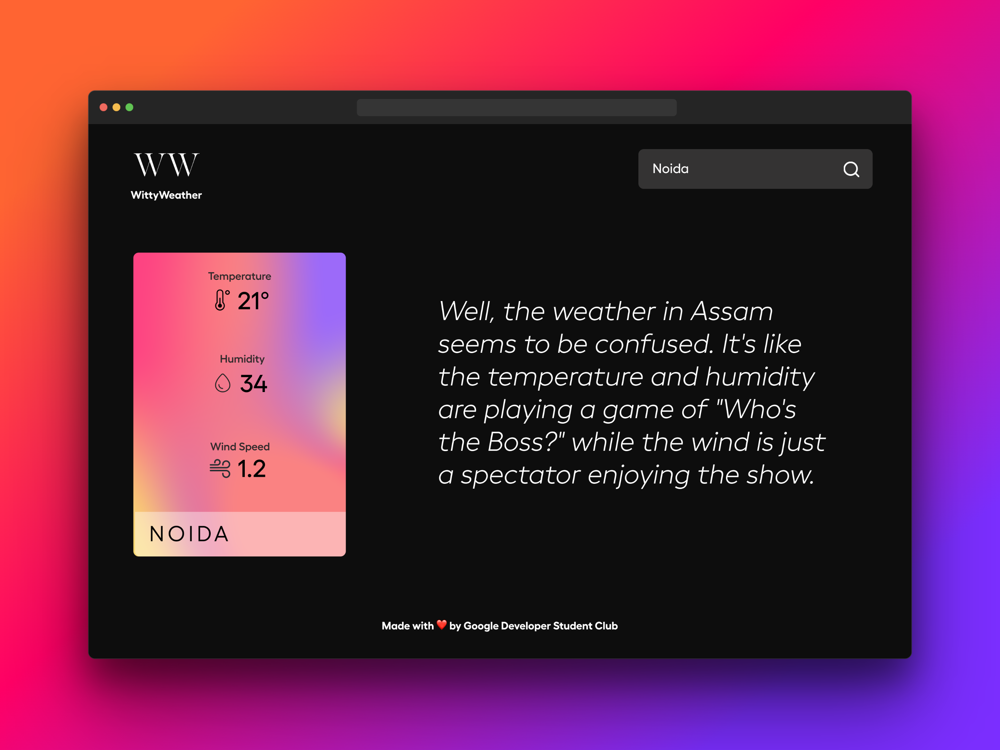
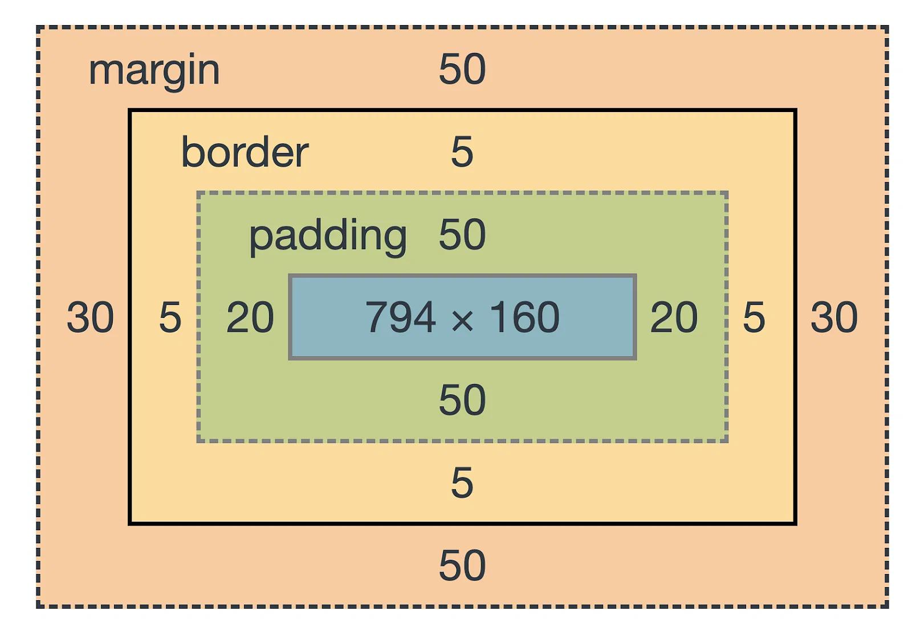

# Web Development Bootcamp

## Introduction 

To start, I would begin by providing a brief overview of the bootcamp's goals and objectives. This would include discussing what web development is and the importance of learning these skills in today's technology-driven world.

Next, I would go over the schedule for the bootcamp, discussing the various topics we will cover and the specific skills that participants will develop. I would also provide an overview of the tools and resources we will be using, including programming languages, software, and online platforms.

### Importance 

Web development is an incredibly important skill to have in today's technology-driven world, as almost all businesses and organizations rely on websites and web applications to communicate with customers, market their products and services, and perform critical business functions. Here are a few reasons why web development is so important:

* **Increased demand for online services**: With the rise of e-commerce, social media, and remote work, more and more services are being offered online. Web developers are needed to build and maintain the websites and applications that allow people to access these services.

* **Web development is a high-growth industry**: According to the Bureau of Labor Statistics, employment of web developers is projected to grow much faster than average for all occupations. This means that there are many job opportunities available for those who have web development skills.

* **Importance of digital presence**: In today's digital age, having a strong online presence is crucial for businesses and individuals alike. A well-designed website can help attract customers, build brand awareness, and establish credibility.

### Schedule 

* 15th March: HTML
* 16th March: CSS
* 17th March: Javascript 

### Tools Used

* Github (Create an ID beforehand) 
* Visual Studio Code
	* Set up VSC with Git [How to setup and use GitHub with Visual Studio Code - [2023] | GitHub | VS Code](https://www.youtube.com/watch?v=mR9jhYD3bnI)

* Create an ID on OpenAI

### Final Website 

In this project, you will build a website that can display the current weather conditions of any city that a user enters. Additionally, you will use an API to generate a clever or amusing comment based on the weather conditions in that city. The website will be designed to adjust its display automatically based on the size of the screen it is being viewed on, so it will look great on any device, whether it's a desktop computer or a smartphone. By completing this project, you will learn how to integrate APIs into your web development projects and create a responsive website that is both functional and visually appealing.

## HTML

HTML stands for Hypertext Markup Language. It is a markup language used to create and structure content on the web. HTML is used to describe the structure and content of web pages, including text, images, videos, and other multimedia elements.

HTML is the foundation of web development and is essential for creating any website. It provides a way to organize content on a webpage, using different tags and elements to define the layout, structure, and functionality of a webpage. HTML is a markup language, meaning it uses a set of tags and attributes to define the elements of a web page, such as headings, paragraphs, links, images, and more.

In order to create a web page using HTML, you need to understand the basics of HTML syntax, which involves learning the different tags and attributes used to structure content on a webpage. With HTML, you can create basic static web pages, or more complex pages with multimedia elements, forms, and interactive features.

### Commonly Used Tags

Here is a brief explanation of some of the most commonly used ones:

* `<html> `tag: This tag is used to start and end an HTML document.

* `<head>` tag: This tag is used to define the head section of an HTML document. It contains information about the document, such as the title and meta tags.

* `<title>` tag: This tag is used to define the title of an HTML document. The title is displayed in the browser's title bar and is also used by search engines.

* `<body>` tag: This tag is used to define the main content of an HTML document.
 
* `<h1> `to `<h6>` tags: These tags are used to define headings of different sizes. `<h1>` is the largest and `<h6>` is the smallest.

* `
 `tag: This tag is used to define a paragraph.
 
* `<a>` tag: This tag is used to create a hyperlink. The href attribute is used to specify the URL of the link.
 
* `` tag: This tag is used to insert an image into an HTML document. The src attribute is used to specify the URL of the image.
 
* `<ul>` tag: This tag is used to create an unordered list. Each item in the list is defined using the `<li>` tag.
 
* `<ol>` tag: This tag is used to create an ordered list. Each item in the list is defined using the `<li>` tag.
 
* `<table>` tag: This tag is used to create a table. The `<tr>` tag is used to define each row, and the `<td>` tag is used to define each cell.
 
* `<form> `tag: This tag is used to create a form. The action attribute is used to specify the URL where the form data should be sent.
 
* `<input> `tag: This tag is used to create form inputs, such as text boxes, radio buttons, checkboxes, and more.

###Explanation

> My cat is very grumpy

If we wanted the text to stand by itself, we could specify that it is a paragraph by enclosing it in a paragraph (`
`) element:

> `
`My cat is very grumpy`
`

#### Anatomy of an HTML Element

The anatomy of our element is:

**The opening tag**: This consists of the name of the element (in this example, p for paragraph), wrapped in opening and closing angle brackets. This opening tag marks where the element begins or starts to take effect. In this example, it precedes the start of the paragraph text.

**The content**: This is the content of the element. In this example, it is the paragraph text.

**The closing tag**: This is the same as the opening tag, except that it includes a forward slash before the element name. This marks where the element ends. Failing to include a closing tag is a common beginner error that can produce peculiar results.
The element is the opening tag, followed by content, followed by the closing tag.

***

#### Nesting Elements 

**Nesting elements**

Elements can be placed within other elements. This is called nesting. If we wanted to state that our cat is very grumpy, we could wrap the word very in a `<strong>` element, which means that the word is to have strong(er) text formatting:

> `
My cat is <strong>very</strong> grumpy.
`
> 
> 
My cat is <strong>very</strong> grumpy.

There is a right and wrong way to do nesting. In the example above, we opened the p element first, then opened the strong element. For proper nesting, we should close the strong element first, before closing the p.

The following is an example of the wrong way to do nesting:

> `
My cat is <strong>very grumpy.
</strong>`

***

#### Block versus Inline Elements
There are two important categories of elements to know in HTML: block-level elements and inline elements.

* **Block-level elements** form a visible block on a page. A block-level element appears on a new line following the content that precedes it. Any content that follows a block-level element also appears on a new line. Block-level elements are usually structural elements on the page. For example, a block-level element might represent headings, paragraphs, lists, navigation menus, or footers. A block-level element wouldn't be nested inside an inline element, but it might be nested inside another block-level element.
* **Inline elements** are contained within block-level elements, and surround only small parts of the document's content (not entire paragraphs or groupings of content). An inline element will not cause a new line to appear in the document. It is typically used with text, for example an `<a>` element creates a hyperlink, and elements such as `<em>` or `<strong>` create emphasis.

Consider the following exapmle: 

> `<em>first</em><em>second</em><em>third</em>`

> `
fourth
`
> 
> `
fifth
`
> 
> `
sixth
`

**The output for the above code will look something like this**
 
> <em>first</em><em>second</em><em>third</em>
>
fourth

>
fifth

>
sixth

***

#### Void elements
Not all elements follow the pattern of an opening tag, content, and a closing tag. Some elements consist of a single tag, which is typically used to insert/embed something in the document. Such elements are called void elements. For example, the  element embeds an image file onto a page:

> ``

The output for the above piece of code will look like this: 
  
>

***

#### What is in the HTML head?

The HTML head is the contents of the `<head>` element. Unlike the contents of the `<body>` element (which are displayed on the page when loaded in a browser), the head's content is not displayed on the page. Instead, the head's job is to contain metadata about the document.

***

#### Applying CSS and JavaScript to HTML
Just about all websites you'll use in the modern day will employ CSS to make them look cool, and JavaScript to power interactive functionality, such as video players, maps, games, and more. These are most commonly applied to a web page using the `<link>` element and the ``

***
 
#### Text Fundamentals

**Lists**

Now let's turn our attention to lists. Lists are everywhere in life—from your shopping list to the list of directions you subconsciously follow to get to your house every day, to the lists of instructions you are following in these tutorials! Lists are everywhere on the web, too, and we've got three different types to worry about.

**Unordered**

Unordered lists are used to mark up lists of items for which the order of the items doesn't matter. Let's take a shopping list as an example:
>milk
>
>eggs
>
>bread
>
>hummus

To covert it to unordered list we write it as

>`<ul>`
>
>`<li>`milk`</li>`
>
>`<li>`eggs`</li>`
>
>`<li>`bread`</li>`
>
>`<li>`hummus`</li>`
>
`</ul>`

**Ordered List**

Just change `<ul>` to `<ol>`

***

#### Creating Hyperlinks

**What is a hyperlink?**

Hyperlinks are one of the most exciting innovations the Web has to offer. They've been a feature of the Web since the beginning, and are what makes the Web a web. Hyperlinks allow us to link documents to other documents or resources, link to specific parts of documents, or make apps available at a web address. Almost any web content can be converted to a link so that when clicked or otherwise activated the web browser goes to another web address.

**Anatomy of a link**

A basic link is created by wrapping the text or other content inside an `<a>` element and using the href attribute, also known as a Hypertext Reference, or target, that contains the web address.

>`
`
>
> `I'm creating a link to <a href="https://www.mozilla.org/en-US/">the Mozilla homepage</a>.`
>
>`
`

This gives us the following result:

>

  I'm creating a link to
  <a href="https://www.mozilla.org/en-US/">the Mozilla homepage</a>.

***

**Linking an image**

***

#### Taking input from the user 

The most used input types are:

* `<input type="button">`

* `<input type="checkbox">`

* `<input type="email">`

* `<input type="file">`

* `<input type="number">`

* `<input type="password">`

* `<input type="radio">`

* `<input type="submit">`

* `<input type="text">`

**Code**

**Text**

>`<form>`
  `<label for="fname">First name:</label> `
  `<input type="text" id="fname" name="fname"> `
  `<label for="lname">Last name:</label> `
  `<input type="text" id="lname" name="lname">`
`</form>`

**Radio Button**

>`<form>`
  `<input type="radio" id="html" name="fav_language" value="HTML">`
  `<label for="html">HTML</label> `
  `<input type="radio" id="css" name="fav_language" value="CSS">`
  `<label for="css">CSS</label> `
  `<input type="radio" id="javascript" name="fav_language" value="JavaScript">`
  `<label for="javascript">JavaScript</label>`
`</form>`

**Checkbox**

>`<form>`
>  `<input type="checkbox" id="vehicle1" name="vehicle1" value="Bike">`
>  `<label for="vehicle1"> I have a bike</label> `
>  `<input type="checkbox" id="vehicle2" name="vehicle2" value="Car">`
>  `<label for="vehicle2"> I have a car</label> `
>  `<input type="checkbox" id="vehicle3" name="vehicle3" value="Boat">`
>  `<label for="vehicle3"> I have a boat</label>`
>`</form>`

**Number**

>`<form>`
>  `<label for="quantity">Quantity (between 1 and 5):</label>`
>  `<input type="number" id="quantity" name="quantity" min="1" max="5">`
>`</form>`

**Button**

>`<input type="button" onclick="alert('Hello World!')" value="Click Me!">`

**Submit**

>`<input type="submit" value="Submit">`

***

#### Div and Span

**The HTML div Tag**

The `
` element is short for "division" and is used to group together content and create a section of the page. It is a block-level element, which means that it takes up the entire width of its parent container and creates a new line after it. The `
` element can be used to create containers for entire sections of a webpage, such as the header, main content, footer, or sidebar. It can also be used to group together related content, such as a set of images or a group of links.

**The HTML span Tag**

The `` element, on the other hand, is used to group together inline elements and apply styles to them. It is an inline element, which means that it only takes up the space that its contents require and does not create a new line. The `` element can be used to style individual words or phrases within a larger block of text, or to apply styles to small pieces of content such as icons, labels, or buttons.

#### BOX MODEL 

The box model is a fundamental concept in web design and refers to how HTML elements are rendered on a web page. Every HTML element is considered a rectangular box, and the box model describes how that box is structured and sized.

The box model consists of four main components: content, padding, border, and margin. Here's a brief overview of each component:

**Content**: This is the innermost part of the box, where the actual content of the element is displayed. It has a width and a height, which are determined by the content itself.

**Padding**: This is the space between the content and the border. It can be thought of as an invisible buffer around the content, and it can be adjusted to create extra space or breathing room.

**Border**: This is a line that surrounds the element and separates it from other elements on the page. It can be styled in various ways, such as with a solid line, dotted line, or no line at all.

**Margin**: This is the space between the border and other elements on the page. It can be thought of as a buffer between the element and other elements, and it can be adjusted to create space between elements or push elements away from each other.

